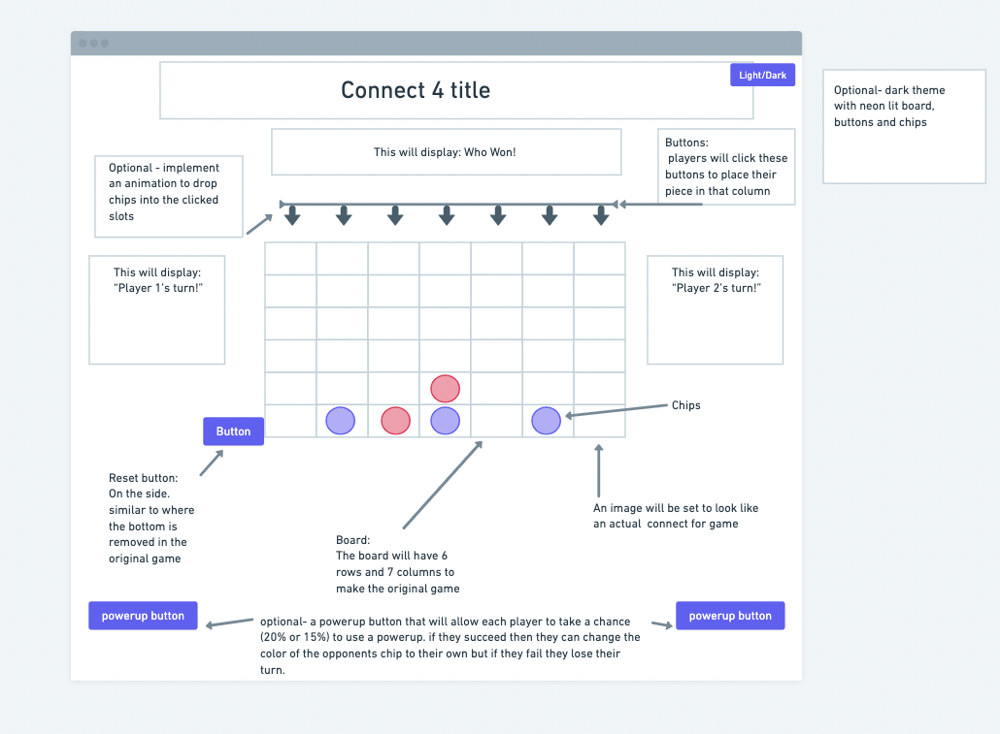

# Connect 4

## To Play the Game

#### click [here](https://connect-4-ih.surge.sh) to play Connect 4.
 _*Note: instructions on how to play can be found within the link._ 
 
 

---
---

## The History
While it has been rumored that Captain Cook once played a similar game, The Connect 4 game was first trademarked in 1974 by Milton Bradly Company. with over a trillion possible outcomes, Connect 4 has become an iconic game for households.
 
 

---
---

## Motivation
Growing up in a small remote town, board games and cards were a staple activity for family night. One of the few games we owned was Connect 4, and while I was not great at winning against my family members, this game instilled life long memories. Now that I am an uncle to a handful of neices and nephew, I thought that I could help instill fun memories through this app.
 
 

---
---

## Screenshots

### Wireframe:

 

### Start of game:

 

### Winner:
 
 
 

---
---

## Technology Implemented

- Javascript
- HTML
- CSS
- Git
- confetti.js
- Animate.css
- Bootstrap
 
 

---
---

## Credits

- Background photo created by rawpixel.com on www.freepik.com.
 
 

---
---

## Stretch Goals:

- light and dark mode
- glowing/neon light theme for dark mode
- animate chips falling into position
- textured chips to mimic actual game peices
- cleaner how to play pop-up button
- ability to select player colors
- confetti colors to match winners color
- sound effects for dropping chip and resetting board
- implement a drag and drop feature to place chip
- add mobile responsiveness
- record previous winners

---